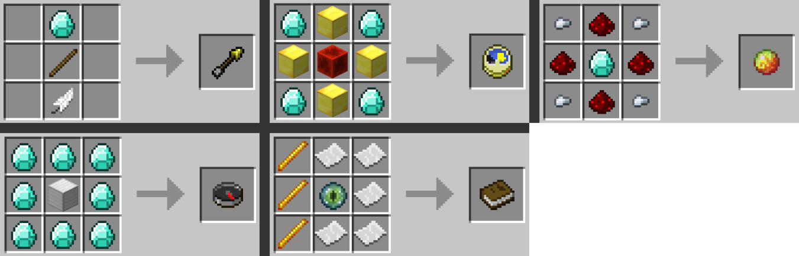

# Claim-plugin

#### *Using [ScriptCraft](https://github.com/walterhiggins/ScriptCraft)*

## Aide

**Commandes**
- Système de home
  - /sethome *nom* : enregistrer un nouveau home ( limite de 2 - modifiable )
  - /delhome *nom* : en supprimer un
  - /home *nom* : s'y téléporter
- Gestion des teams
  - /create *nom couleur* : créer une team ( voir couleurs valides )
  - /quit : quitter sa team ( la supprime si dernier membre et enlève toutes les invitations )
  - /invite : inviter quelqu'un dans sa team
  - /accept *nom* : accepter l'invitation de la team
  - /decline *nom* : la refuser
- Zone claim de team
  - /claim : recevoir le claim block qui claim la zone autour de lui ( rayon de 8 par défaut - carré )
  - /unclaim : retirer le claim block
  - /base : se téléporter au claim block de sa team ( si les 2 blocs au dessus sont vides - air )
  
**Crafts**
- Items vanilla : slime ball, teinture verte, portail de l'end + autres avec `addRecipe(item, forme, ingrédients)`

*Crafts dans l'ordre*
- Flèches explosives ( explosion puissance 3 )
- Base finder : click droit renvoie les bases détectées dans un rayon de 100 block ( carré ), les différences d'altitudes brouillent la qualité du signal, toutes les infos ne sont pas vraies ! ( 30s de cooldown )
  - Altitudes : 200+ → 85% fiable  //  120+ → 70%  //  80+ → 60%  //  60+ → 50%  //  40+ → 35%  //  20+ → 25%  //  0+ → 20%  ( précision minimum )
- Balise de traçage : après initialisation, renvoie la position de la personne à qui elle à été drop ( fonctionne avec *traceur* )
  - Une nouvelle balise désactive l'ancienne
- Traceur : pointe dans la direction de la balise concerné ( mis à jour toutes les 10 secondes )
- Livre de Purification **DE LA MORT** 💀 : enlève toutes les balises sur soi et renvoie si il y en avait ( 2min de cooldown )

*Crafts dans l'ordre*

#### *Require claim-data folder : claim-data/teams.json + claim-data/players.json*
